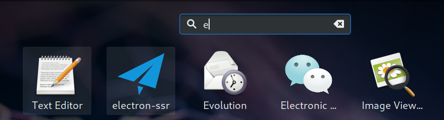

# Fedora


### Apache发布

```
参考资料 https://www.jianshu.com/p/eee34947da43
apache  
启动服务：systemctl start httpd.service
文件位置：cd /var/www/html
配置文件： /etc/httpd/conf.d/welcome.conf
访问地址 http://localhost
```


### 安装SSR

```
libev 版的 Shadowsocks ，该版本的特点是内存占用小（600k左右），低 CPU 消耗

介绍：
Shadowsocks-libev is a lightweight secured SOCKS5 proxy for embedded devices and low-end boxes.

github地址：
https://github.com/shadowsocksr-backup/shadowsocksr-libev.git

https://github.com/shadowsocks/shadowsocks-libev


这里提供简单的安装办法：  

electron-ssr 是一个非常美观的 GUI 界面 SSR 客户端，支持订阅等若干高级功能。
另外，Appimage 文件支持几乎所有 Linux 发行版，不用考虑依赖问题。

安装步骤：

1.下载RPM版本
https://github.com/shadowsocksrr/electron-ssr/releases/tag/v0.2.7


2. 下载完成后切换root用户进行安装
sudo su -

rpm -ivh electron-ssr-0.2.7.rpm
或者使用下面命令：
dnf localinstall electron-ssr-0.2.7.rpm


3.安装完成打开图形化界面进行相关配置
```



```
4.配置完成后：
Chrome浏览器使用proxySwitchOmega进行配置

新增SOCKS5 127.0.0.1 1080
```

